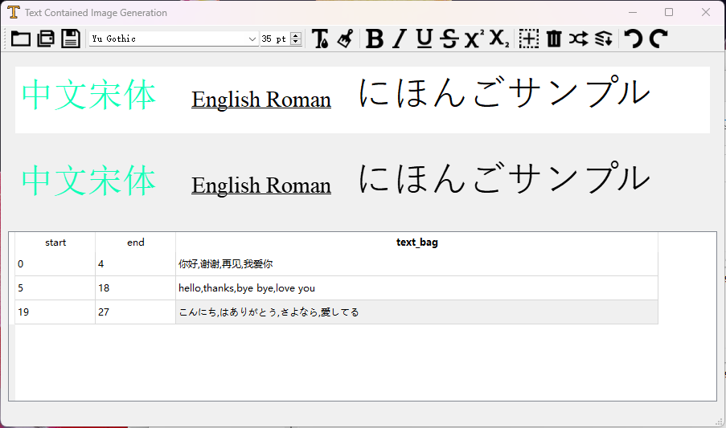

# Text Contained Image Generation
A synthetic data generator for text recognition with user interface.

## What is it for?
This work is inpired by [TRDG](https://github.com/Belval/TextRecognitionDataGenerator) which is an excellent tool to generate data for text recognition. This work can be seen as a supplement to TRDG. You may consider this work if you need:
1. A tool with user interface that makes your generation easier.
2. A tool that has better text format support, such as, underlined text, partly highlighted text, etc.
3. A tool that has better non-latin text support. It means you can use all system fonts or even use them together in single text line.
Basically, it's a **fully functional line text eidtor**, and converts your text into image.

note: This work currently doesn't provide blurring, distortion and other after-process features that are supported by TRDG, as these features are not key to this work and can be easily applied by users.

The general UI design is inherited from this great [tutorial](https://github.com/goldsborough/Writer-Tutorial).

## How to use
Clone this repository
```bash
git clone https://github.com/wushidiguo/TextContainedImageGeneration
cd TextContainedImageGeneration
```
If you don't have PyQt5 in your system or virtual environment, please install PyQt5 first.
```bash
pip install PyQt5
```
Then,
```bash
python3 run.py
```
It's ready for use!



## Demo


## How does it work?
- It renders the contents of the editor to a pixmap immediately. 
- When you generate multiple images, it randomly pick text pieces from the text bags you have set, and paste the text pieces to the *start to end* region of the text (in the editor), so the generated text will keep format.