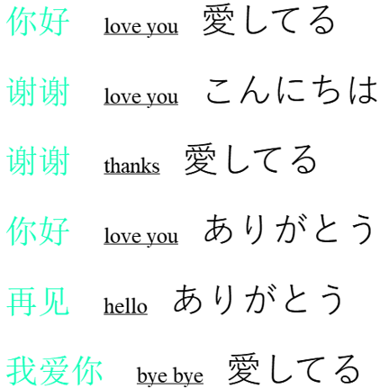

# Text Contained Image Generation
A synthetic data generator for text recognition with user interface.

## What is it for?
This work is inpired by [TRDG](https://github.com/Belval/TextRecognitionDataGenerator) which is an excellent tool to generate data for text recognition. This work can be seen as a supplement to TRDG. You may consider to use this work if you need:
1. A tool with user interface that makes your generation easier.
2. A tool that has better text format support, such as, underlined text, partly highlighted text, etc.
3. A tool that has better non-latin text support.
Basically, it's a **fully functional line text eidtor**, and converts your text into image.

note: This work currently doesn't provide blurring, distortion and other after-process features that are supported by TRDG.

The general UI design is inherited from this great [tutorial](https://github.com/goldsborough/Writer-Tutorial).

## How to use
Clone this repository
```bash
git clone https://github.com/wushidiguo/TextContainedImageGeneration
cd TextContainedImageGeneration
```
If you don't have PyQt5 in your system or virtual environment, please install PyQt5 first.
```bash
pip install PyQt5
```
Then,
```bash
python3 run.py
```
Input texts in the input area, and set all the fonts and formats. Then select the text range that you want to be randomly replaced during generating, and click the "set dummy" button to add a "text bag" which means the resource of text pieces to choose from. During generation, a text piece will be randomly picked from the "text bag" to replace the piece at corresponding postion for each generated image.

Click "generate images" button and input the number of images you want to generate, then click "OK" to start generating.

All generated images are RGBA format with transparent background for further processing.

You can also save the whole settings as a file for late use.


## Demo(some generated images)
